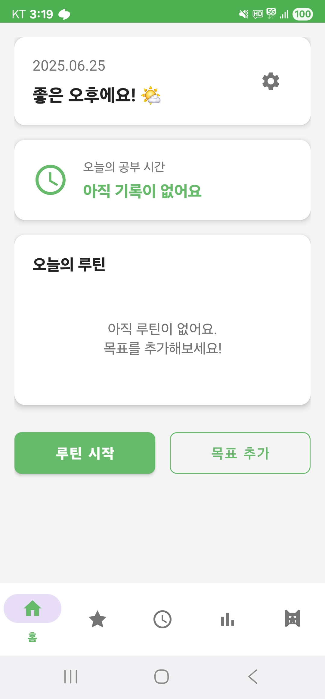

# StudyOn

StudyOn은 효과적인 학습 루틴 관리와 목표 달성을 지원하는 Android 애플리케이션입니다.

## 스크린샷

   

  

## 개요

StudyOn은 개인의 학습 목표를 설정하고, 일일 루틴을 관리하며, 학습 통계를 시각화하여 지속적인 학습 동기를 제공하는 앱입니다. 로컬 데이터베이스를 활용하여 개인정보 보호와 빠른 접근성을 보장합니다.

## 주요 기능

### 홈 화면
- 오늘의 루틴 확인 및 체크
- 일일 학습 시간 확인
- 직관적인 루틴 시작 인터페이스

### 목표 관리
- 학습 목표 설정 및 관리
- 할 일 목록 생성 및 추적
- 마감일 및 태그 기반 분류
- 반복 작업 설정

### 루틴 기록
- 학습 시간 타이머 기능
- 수동 시간 입력 지원
- 학습 내용 메모 기능
- 목표별 시간 분류

### 통계 분석
- 주간/월간 학습 패턴 분석
- 목표별 시간 분포 차트
- 시간대별 집중도 히트맵
- 총 학습 시간 누적 통계

### 성취 시스템
- 학습 배지 및 어워드 시스템
- 연속 학습 달력
- 목표 달성률 추적
- 다음 목표 안내

### 설정
- 라이트/다크 테마 지원
- 알림 설정
- 데이터 초기화 기능

## 기술 스택

### 아키텍처
- **MVVM (Model-View-ViewModel)** 패턴
- **Repository 패턴**을 통한 데이터 계층 분리

### 주요 라이브러리
- **Room Database** : 로컬 데이터 저장
- **Navigation Component** : 프래그먼트 네비게이션
- **LiveData & ViewModel** : 반응형 UI 및 생명주기 관리
- **View Binding & Data Binding** : 안전한 뷰 접근
- **MPAndroidChart** : 통계 차트 시각화
- **SharedPreferences** : 앱 설정 저장

### 개발 환경
- **언어** : Kotlin
- **최소 SDK** : API 24 (Android 7.0)
- **타겟 SDK** : API 34 (Android 14)
- **컴파일 SDK** : API 34

## 데이터베이스 구조

### GoalEntity
목표 정보를 저장하는 테이블
- 목표 ID, 제목, 태그, 마감일, 생성일

### TodoEntity
할 일 정보를 저장하는 테이블
- 할 일 ID, 연결된 목표 ID, 내용, 기한, 완료 여부, 반복 설정

### RoutineLogEntity
학습 기록을 저장하는 테이블
- 로그 ID, 날짜, 목표 ID, 학습 시간, 메모

### AwardEntity
획득한 배지 정보를 저장하는 테이블
- 배지 ID, 이름, 획득 날짜, 설명, 유형

## 프로젝트 구조

```
app/src/main/java/com/studyon/app/
├── data/
│   ├── dao/           # Room DAO 인터페이스
│   ├── database/      # 데이터베이스 클래스
│   ├── entity/        # 데이터 엔티티
│   ├── preferences/   # SharedPreferences 관리
│   └── repository/    # Repository 클래스
├── ui/
│   ├── adapter/       # RecyclerView 어댑터
│   ├── fragment/      # UI 프래그먼트
│   └── viewmodel/     # ViewModel 클래스
├── MainActivity.kt    # 메인 액티비티
└── SplashActivity.kt  # 스플래시 화면
```

## 화면 구성

- **스플래시** : 앱 로고 및 초기화
- **홈** : 오늘의 루틴 관리
- **목표** : 학습 목표 및 할 일 관리
- **루틴** : 학습 시간 기록
- **통계** : 학습 패턴 분석
- **어워드** : 성취 배지 확인
- **설정** : 앱 환경 설정

## 라이선스

이 프로젝트는 개인 학습 목적으로 개발되었습니다.

##  개발자

**이지맨**
- GitHub : [qwer123toy](https://github.com/qwer123toy)